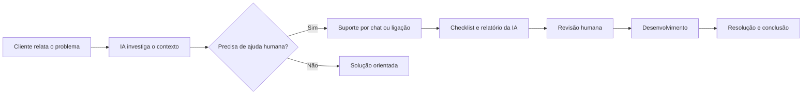

<div align="center">
  

  <h1>ResolveTech</h1>
  <p><strong>Do primeiro contato à solução, nenhuma informação fica pelo caminho.</strong></p>
  <p>
    <a href="#avisos-importantes-de-segurança"></a>
    <a href="#tecnologias"></a>
    <a href="#tecnologias"></a>
    <a href="#privacidade-e-consentimento"></a>
    <a href="#funcionalidades-do-mvp"></a>
  </p>
  <p>
    <a href="#o-problema-que-resolvemos">Visão geral</a> ·
    <a href="#funcionalidades-do-mvp">Funcionalidades</a> ·
    <a href="#instalação-local">Instalação</a> ·
    <a href="#implantação-no-railway">Railway</a> ·
    <a href="#avisos-importantes-de-segurança">Segurança</a>
  </p>
</div>

---

O **ResolveTech** é um MVP de uma central de suporte para empresas de software. Ele conecta cliente, suporte e desenvolvimento em um fluxo único, preservando contexto, organizando a investigação com IA e evitando que o cliente precise explicar o mesmo problema várias vezes.

## O problema que resolvemos

Em atendimentos tradicionais, informações importantes ficam espalhadas entre chats, ligações, formulários e anotações. Quando a demanda chega ao desenvolvimento, frequentemente faltam passos para reprodução, ambiente, impacto, arquivos ou tentativas já realizadas. Isso gera retrabalho, demora e custo.

O ResolveTech concentra tudo em uma demanda rastreável:



## Funcionalidades do MVP

| Área | O que o ResolveTech oferece |
| --- | --- |
| **Atendimento** | Chat investigativo com IA, suporte humano e histórico contínuo |
| **Comunicação** | Chat interno, anexos e ligação WebRTC com som de chamada |
| **Formulários** | Formulários personalizados, criação automática por protocolo e versionamento |
| **Triagem** | Checklist, prioridade, relatório técnico e revisão humana obrigatória |
| **Desenvolvimento** | Recebimento apenas de demandas encaminhadas e atualização do andamento |
| **Gestão** | Perfis distintos, funcionários, catálogo de problemas e isolamento por empresa |
| **Plataforma** | PWA responsivo, persistência SQLite e implantação com Docker/Railway |

> [!IMPORTANT]
> Demandas antigas mantêm a versão original do formulário, mesmo depois que a empresa edita ou remove aquele tipo de problema.

## Tecnologias

| Camada | Tecnologias |
| --- | --- |
| Frontend | React 19, TypeScript e Vite |
| Backend | Python 3.12 |
| Dados | SQLite com volume persistente |
| Inteligência artificial | Groq API · `openai/gpt-oss-120b` |
| Voz | WebRTC · Cloudflare Realtime SFU |
| Infraestrutura | Docker e Railway |

## Requisitos

- Node.js 22.13 ou superior.
- Python 3.12 ou superior.
- Uma chave da [Groq](https://console.groq.com/keys) para os recursos de IA.
- Opcionalmente, um App ID e segredo do Cloudflare Realtime para chamadas.

## Instalação local

### 1. Baixe e instale as dependências

```bash
git clone https://github.com/PramioIFC/ResolveTech.git
cd ResolveTech
npm install
```

Como o repositório é privado, a conta usada no clone precisa ter acesso.

### 2. Configure o ambiente

Copie `.env.example` para `.env` e preencha somente no arquivo local:

```env
HOST=127.0.0.1
PORT=8000
GROQ_API_KEY=sua_chave_groq
CLOUDFLARE_CALLS_APP_ID=seu_app_id
CLOUDFLARE_CALLS_APP_SECRET=seu_segredo_cloudflare
RESOLVETECH_DATA=./data
```

Não envie o arquivo `.env` ao Git. Para usar apenas chat e formulários, as duas variáveis da Cloudflare podem ficar vazias.

### 3. Compile e execute

```bash
npm run build:local
npm run start:local
```

Acesse `http://localhost:8000`. No Windows, também é possível usar `CONFIGURAR-WINDOWS.bat` e depois `INICIAR-WINDOWS.bat`.

Ao trocar `GROQ_API_KEY`, execute novamente `npm run build:local`, pois esta demonstração incorpora a chave no frontend durante o build.

## Execução com Docker Compose

Crie o `.env` e execute:

```bash
docker compose up --build
```

O site ficará em `http://localhost:8000`. O volume `resolvetech-data` mantém o banco e os anexos mesmo após recriar o contêiner.

## Implantação no Railway

1. Crie um projeto a partir deste repositório GitHub.
2. Adicione as variáveis `GROQ_API_KEY`, `CLOUDFLARE_CALLS_APP_ID` e `CLOUDFLARE_CALLS_APP_SECRET`.
3. Configure `HOST=0.0.0.0` e deixe o Railway fornecer `PORT`.
4. Crie um volume e monte-o em `/app/data`.
5. Gere um domínio público para a porta `8000`.
6. Faça o deploy. Novos commits na branch conectada serão implantados automaticamente.

Sem o volume, demandas, usuários e anexos podem desaparecer quando o serviço for recriado. O computador do desenvolvedor não precisa ficar ligado depois que o Railway estiver online.

## Testes

```bash
npm run build:local
python -m unittest discover -s tests -v
node tests/test_integrations.mjs
```

Os testes cobrem autenticação, isolamento entre empresas, chat, permissões, anexos, relatórios, encaminhamento ao desenvolvimento, estados da demanda e PWA.

## Privacidade e consentimento

- O cliente precisa autorizar o envio da conversa textual à Groq antes de usar a IA.
- O histórico textual do chat é preservado para suporte e desenvolvimento.
- A ligação WebRTC transmite áudio ao vivo; o MVP não grava nem transcreve a voz.
- Senhas, tokens, chaves de API e outros dados sensíveis não devem ser enviados nos atendimentos.

## Avisos importantes de segurança

> [!WARNING]
> Este projeto é **somente um MVP acadêmico e uma demonstração**. Ele não é um sistema pronto para produção.

- A chave Groq é incorporada ao JavaScript e fica visível no navegador. Isso foi aceito apenas para a demonstração. Em produção, as chamadas à IA devem passar por um backend protegido, com autenticação, cotas e limites por cliente.
- As contas de demonstração têm senha conhecida e devem ser removidas antes de qualquer uso real.
- SQLite atende ao MVP, mas uma implantação comercial deve usar banco gerenciado, backups, migrações e monitoramento.
- O servidor Python usa uma implementação simples e precisa de revisão de segurança, observabilidade e testes de carga.
- Não há recuperação de senha, MFA, verificação de e-mail, antivírus de anexos, criptografia própria de arquivos ou política automatizada de retenção.
- O controle de abuso e rate limiting é básico.
- O projeto não declara conformidade com LGPD, SLA, auditoria inviolável ou certificação de segurança.
- Tokens publicados ou compartilhados devem ser revogados e substituídos imediatamente.

Para um produto real, recomenda-se mover segredos para o backend, usar PostgreSQL, armazenamento de objetos, antivírus, logs centralizados, backups, gestão de consentimento e uma avaliação profissional de segurança e privacidade.

## Estrutura principal

```text
app/                       Interface e páginas principais
components/                Chat, chamada e componentes visuais
lib/groq-browser.ts        Integração Groq da demonstração
lib/cloudflare-voice.ts    Cliente WebRTC
backend/server.py          API, autenticação e persistência
backend/chat.py            Fluxo de conversa e encaminhamento
backend/voice.py           Sinalização Cloudflare Realtime
backend/schema.sql         Estrutura do banco SQLite
tests/                     Testes integrados do MVP
Dockerfile                 Imagem utilizada no Railway
```

## Estado do projeto

O ResolveTech demonstra a proposta de reduzir retrabalho no suporte técnico por meio de coleta estruturada, continuidade de contexto e uma passagem de responsabilidade clara entre suporte e desenvolvimento. As limitações acima são conhecidas e fazem parte do escopo reduzido do MVP.

---

<div align="center">
  <strong>ResolveTech · Hackathon IFC Concórdia</strong><br />
  Informação organizada. Responsabilidade clara.
</div>
